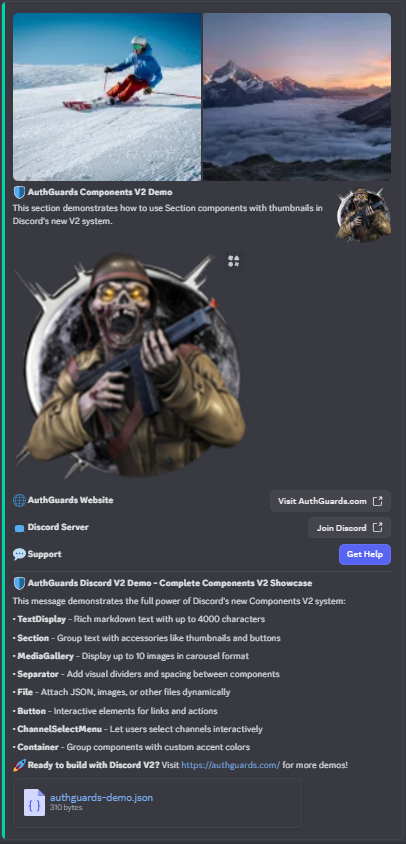

# 🛡️ AuthGuards Discord V2 Demo

A comprehensive Discord bot demonstrating the revolutionary **Discord Components V2** system. This demo showcases how to build modern, interactive Discord applications using the latest Discord.js features and Components V2 architecture.


## 🌟 What is Discord Components V2?

Discord Components V2 is the next generation of Discord's component system, offering:

- **Rich Text Displays** - Up to 4000 characters with full markdown support
- **Advanced Layouts** - Sections, containers, and media galleries
- **Interactive Elements** - Buttons, select menus, and file attachments
- **Modern Design** - Clean, organized, and visually appealing interfaces

## 🎯 What This Demo Shows

This version demonstrates **ALL** Discord Components V2 features using the proper Discord.js builders, brought to you by **AuthGuards**.

### 🛡️ AuthGuards Components V2 Features:

1. **🔹 TextDisplay** - Static text with markdown support (up to 4000 characters)
2. **📏 Separator** - Visual dividers with spacing options  
3. **📄 Section** - Groups text with accessories (thumbnails, buttons)
4. **🖼️ Thumbnail** - Small images in sections
5. **📺 ChannelSelectMenu** - Dropdown for channel selection
6. **🖼️ MediaGallery** - Image carousels/galleries (up to 10 images)
7. **🔘 Button** - Interactive elements (links and actions)
8. **📎 File** - Attached files (JSON, images, etc.)
9. **📦 Container** - Groups multiple components with accent colors

### 🚀 Interactive Features:
- **Channel Selection** - Shows selected channel info with Components V2
- **Support Button** - Displays AuthGuards help information using Components V2
- **File Download** - AuthGuards demo JSON file attachment
- **Link Buttons** - Direct links to AuthGuards.com and Discord server

## 🚀 Quick Start

### 1. Clone the Repository
```bash
git clone https://github.com/authguards/discord-v2-demo.git
cd discord-v2-demo
```

### 2. Install Dependencies
```bash
npm install
```

### 3. Configure the Bot
Edit the configuration in `index.js` and `deploy-commands.js`:
```javascript
const config = {
    token: 'YOUR_BOT_TOKEN_HERE',
    clientId: 'YOUR_CLIENT_ID_HERE',
    guildId: 'YOUR_GUILD_ID_HERE' // Optional, for testing
};
```

### 4. Deploy Commands
```bash
npm run deploy
```

### 5. Start the Bot
```bash
npm start
```

### 6. Test the Demo
- Use `/demo` command in your Discord server
- See all Components V2 features in action!

## 📋 Commands

- **`/demo`** - Comprehensive Components V2 demonstration with AuthGuards branding

## 🔧 How to Get Your Discord Bot Credentials

### 1. Create a Discord Application
1. Go to [Discord Developer Portal](https://discord.com/developers/applications)
2. Click "New Application"
3. Give your application a name (e.g., "AuthGuards V2 Demo")
4. Click "Create"

### 2. Get Your Client ID
1. In your application, go to "General Information"
2. Copy the "Application ID" - this is your `DISCORD_CLIENT_ID`

### 3. Create a Bot
1. Go to the "Bot" section in your application
2. Click "Add Bot"
3. Copy the bot token - this is your `DISCORD_BOT_TOKEN`
4. **Important**: Keep this token secret!

### 4. Get Your Guild ID (Optional)
1. Enable Developer Mode in Discord (User Settings > Advanced > Developer Mode)
2. Right-click on your server name
3. Click "Copy ID" - this is your `DISCORD_GUILD_ID`

### 5. Set Bot Permissions
1. Go to "OAuth2" > "URL Generator"
2. Select "bot" and "applications.commands" scopes
3. Select these permissions:
   - Send Messages
   - Use Slash Commands
   - Embed Links
   - Attach Files
   - Read Message History
4. Copy the generated URL and invite the bot to your server

## 🔧 Technical Implementation

### Components V2 Message Structure
```javascript
const message = {
    content: 'Your message content',
    flags: MessageFlags.IsComponentsV2, // Enable Components V2
    components: [
        // Component array here
    ]
};
```

### Key Component Types
- **Type 9**: Sections (text with optional accessories)
- **Type 10**: Text Displays (markdown text)
- **Type 11**: Thumbnails (small images)
- **Type 12**: Media Galleries (image collections)
- **Type 14**: Separators (spacing elements)

## 🎨 What Makes This Special

This demo version shows the **complete implementation** of Discord's Components V2 system with AuthGuards branding:

- **🛡️ AuthGuards Branding** - Custom colors, links, and styling
- **Proper Builders** - Uses official Discord.js Components V2 builders
- **Real Examples** - Every component type with practical examples
- **Interactive Design** - Buttons and select menus that actually work
- **File Attachments** - Dynamic AuthGuards demo file generation
- **Rich Layout** - Container with AuthGuards accent colors and organized structure
- **Comprehensive Guide** - Built-in documentation explaining each component

## 🌐 AuthGuards Resources

- **Website**: [https://authguards.com](https://authguards.com)
- **Discord Server**: [https://discord.authguards.com](https://discord.authguards.com)
- **GitHub**: [https://github.com/authguards](https://github.com/authguards)

## 📚 Learning Resources

This demo is based on official Discord documentation and best practices:

- [Discord Components V2 Overview](https://discord.com/developers/docs/components/overview)
- [Message.style Components V2 Guide](https://message.style/docs/features/components-v2/)
- [Discord.js Documentation](https://discord.js.org/#/docs)
- [Discord Developer Portal](https://discord.com/developers/docs)

## 🤝 Contributing

We welcome contributions to improve this demo! Here's how you can help:

1. **Fork the repository**
2. **Create a feature branch** (`git checkout -b feature/amazing-feature`)
3. **Commit your changes** (`git commit -m 'Add amazing feature'`)
4. **Push to the branch** (`git push origin feature/amazing-feature`)
5. **Open a Pull Request**

### Areas for Contribution
- Add new Components V2 examples
- Improve existing functionality
- Fix bugs or issues
- Add new interactive features
- Enhance documentation

## 📄 License

This project is licensed under the MIT License - see the [LICENSE](LICENSE) file for details.

## ⚠️ Important Notes

- **Components V2** is still experimental and may have limitations
- **Discord.js v14.14.1+** is required for full functionality
- **Test thoroughly** in a development server before production deployment
- **Rate Limits** - Be aware of Discord's API restrictions

## 🆘 Troubleshooting

### Common Issues

1. **Bot not responding to commands**
   - Check bot permissions in your server
   - Verify the bot token is correct
   - Ensure the bot is online

2. **Components not displaying**
   - Verify `MessageFlags.IsComponentsV2` is set
   - Check Discord.js version (14.14.1+ required)
   - Ensure proper component structure

3. **Commands not registering**
   - Run `npm run deploy` to register commands
   - Check client ID and bot token
   - Verify bot has `applications.commands` scope

### Getting Help

- **Discord Support**: [https://discord.authguards.com](https://discord.authguards.com)
- **GitHub Issues**: [Create an issue](https://github.com/authguards/discord-v2-demo/issues)
- **Documentation**: [https://authguards.com](https://authguards.com)

## 🎉 Acknowledgments

- **Discord Team** - For creating the amazing Components V2 system
- **Discord.js Team** - For the excellent library and documentation
- **AuthGuards Community** - For feedback and support

---



<div align="center">

**🛡️ Built with ❤️ by [AuthGuards](https://authguards.com)**

[Website](https://authguards.com) • [Discord](https://discord.authguards.com) • [GitHub](https://github.com/authguards)

*Ready to build the future of Discord applications? Start with this demo!*

</div>
